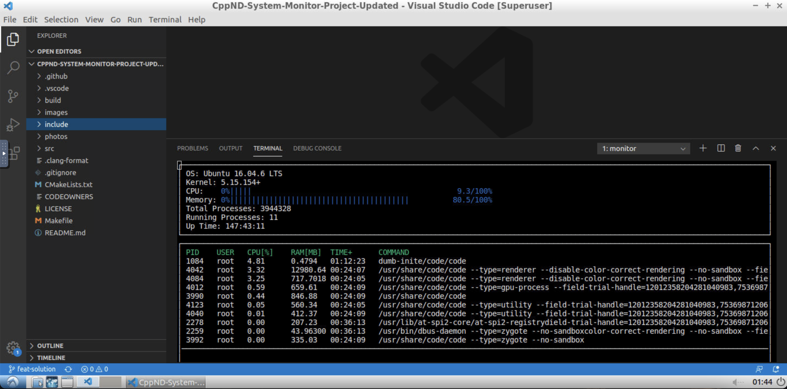

# CppND-System-Monitor

Starter code for System Monitor Project in the Object Oriented Programming Course of the [Udacity C++ Nanodegree Program](https://www.udacity.com/course/c-plus-plus-nanodegree--nd213). 

Follow along with the classroom lesson to complete the project!

## Udacity Linux Workspace
[Udacity](https://www.udacity.com/) provides a browser-based Linux [Workspace](https://engineering.udacity.com/creating-a-gpu-enhanced-virtual-desktop-for-udacity-497bdd91a505) for students. 

You are welcome to develop this project on your local machine, and you are not required to use the Udacity Workspace. However, the Workspace provides a convenient and consistent Linux development environment we encourage you to try.

## ncurses
[ncurses](https://www.gnu.org/software/ncurses/) is a library that facilitates text-based graphical output in the terminal. This project relies on ncurses for display output.

Within the Udacity Workspace, `.student_bashrc` automatically installs ncurses every time you launch the Workspace.

If you are not using the Workspace, install ncurses within your own Linux environment: `sudo apt install libncurses5-dev libncursesw5-dev`

## Make
This project uses [Make](https://www.gnu.org/software/make/). The Makefile has four targets:
* `build` compiles the source code and generates an executable
* `format` applies [ClangFormat](https://clang.llvm.org/docs/ClangFormat.html) to style the source code
* `debug` compiles the source code and generates an executable, including debugging symbols
* `clean` deletes the `build/` directory, including all of the build artifacts

## Instructions

1. Clone the project repository: `git clone https://github.com/udacity/CppND-System-Monitor-Project-Updated.git`

2. Build the project: `make build`

3. Run the resulting executable: `./build/monitor`

4. Follow along with the lesson.

5. Implement the `System`, `Process`, and `Processor` classes, as well as functions within the `LinuxParser` namespace.

6. Submit!

## Project Rubric  
### 1. Basic Requirements
#### 1.1 The student will be able to organize code in a project structure.
Yes, he is.
#### 1.2 The student will be able to write warning-free code.
Yes, he is.
#### 1.3 The student will be able to create a working project.
Yes, he is.
#### 1.4 The student will be able to organize code using object oriented programming principles.
Yes, he is.
### 2. System Requirements
#### 2.1 The student will be able to extract and display basic data about the system.
Yes, he is.
#### 2.2 The student will be able to use composition.
Yes, he is.
### 3. Processor Requirements
#### 3.1 The student will be able to read and display data about the CPU.
Yes, he is.
### 4. Process Requirements
#### 4.1 The student will be able to read and display the processes on the system.
Yes, he is.
#### 4.2 The student will be able to display data about individual processes.
Yes, he is.

## Photos
### 1. Example
